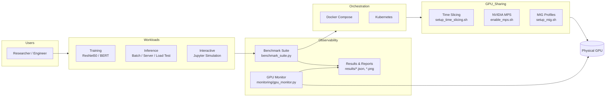
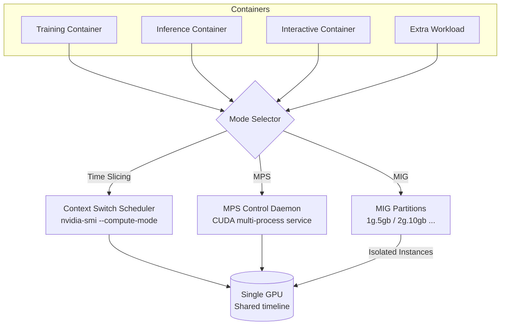

**Key:** Users submit experiments that trigger the workload suite. Docker or Kubernetes orchestrates containers configured with a specific GPU sharing mode before executing on the physical GPU. Benchmarking and monitoring pipelines collect metrics and persist them under `results/`.

## Workload Lifecycle

This diagram captures the canonical workflow used in documentation (`PROJECT_STRUCTURE.md`, `EXPERIMENTS_GUIDE.md`) for executing experiments end to end.

```mermaid
flowchart LR
    Setup[Setup & Build\nrequirements.txt, docker/build_all.sh]
    Baseline[Run Baseline\nSingle workload]
    Configure[Configure GPU Sharing\nsetup_time_slicing.sh &#124; enable_mps.sh &#124; setup_mig.sh]
    Benchmark[Run Benchmarks\nbenchmark_suite.py, run_experiments.sh]
    Monitor[Monitor GPU\nmonitoring/gpu_monitor.py]
    Analyze[Analyze Results\nbenchmarking/analyze_results.py]
    Document[Document Findings\nRESULTS_TEMPLATE.md]

    Setup --> Baseline --> Configure --> Benchmark --> Monitor --> Analyze --> Document
```

This illustrates the hand-offs between automation scripts: initial environment preparation, baseline runs, GPU mode configuration, concurrent benchmarking, real-time monitoring, post-processing, and documentation.

## GPU Sharing Topology

The final diagram compares how containers reach the GPU across Time Slicing, MPS, and MIG. It highlights isolation vs. concurrency trade-offs that the project studies.

**Trade-offs:**
- **Time Slicing:** Software multiplexing; good utilization, added latency.
- **MPS:** Concurrent kernels; lower overhead, limited isolation.
- **MIG:** Hardware partitions; strict isolation, fixed capacity slices.
